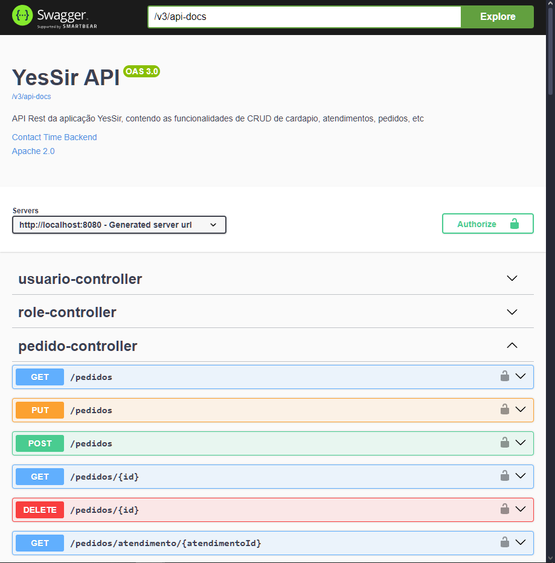
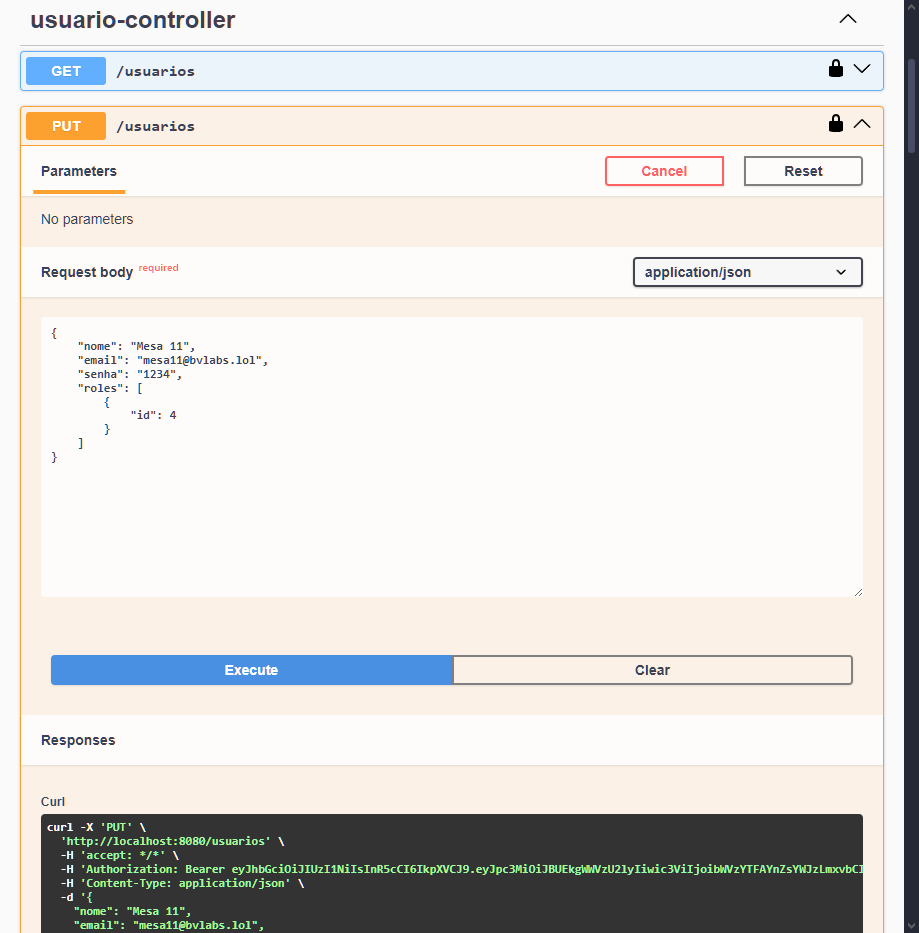
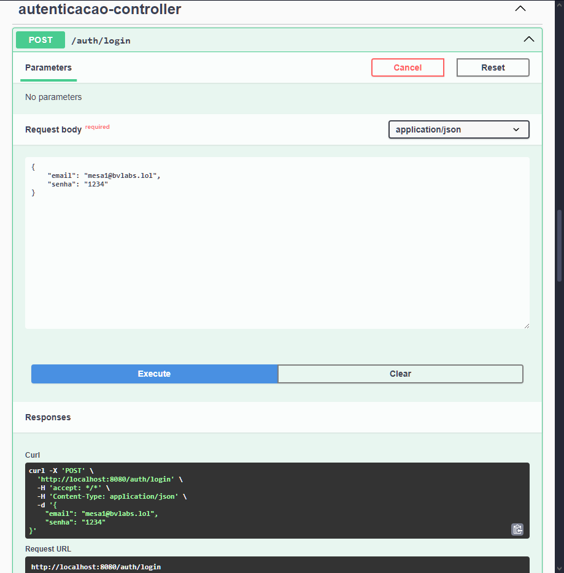

# YesSirAPI

YesSir é um sistema de atendimento ao cliente em restaurantes. No momento é um MVP que está em seu início, mas que promete muitas funcionalidades novas interessantes para serem desenvolvidas.

# Api em Java e Spring Boot 3

Essa será a API inicial para permitir o desenvolvimento do frontend.


## 🛠️ Site

[http://www.bvlabs.lol](http://www.bvlabs.lol)


## 🛠️ Instalação via Docker

###### Pré-requisito mínimo

* Ter o [Docker instalado](https://www.docker.com)


## 🛠️ Execução via Docker

Abra o terminal, entre na pasta raiz do projeto e execute o seguinte comando:

```bash
$ docker-compose up
```


## 🛠️ Instalação manual

###### Pré-requisitos mínimos

* Ter o [Docker instalado](https://www.docker.com) para Subir o banco de dados
* Possuir os Requisitos Java

###### Subir o banco de dados via Docker

Abra o terminal, entre na pasta yessir-database dentro da raiz do projeto e execute o seguinte comando:

```bash
$ docker-compose up
```

###### Requisitos Java

* Java 21 ([Linux](https://www.rosehosting.com/blog/how-to-install-java-21-on-ubuntu-24-04/) ou [Mac](https://medium.com/@aniketvishal/how-to-install-java-and-setup-java-home-path-in-macos-apple-silicon-m1-m2-2edf185b992c))
* Maven 3.6.3 ([download](https://archive.apache.org/dist/maven/maven-3/3.6.3/binaries/)/[configuração](https://www.baeldung.com/install-maven-on-windows-linux-mac))


## 🛠️ Execução manual

Abra outro terminal, entre na pasta raiz do projeto e execute os seguintes comandos:

```bash
mvn package -Dmaven.test.skip
```
```bash
java -Dspring.profiles.active=default -jar yessir.jar
```

Agora sim, deixe os dois terminais (database e api) em execução e estará tudo pronto para realização de testes!


## 🛠️ Documentação

Com a aplicação em execução, abra o seu navegador e acesse [http://localhost:8080/swagger-ui/index.html](http://localhost:8080/swagger-ui/index.html) para ter acesso ao Swagger, onde estarão listados os endpoints da API e como ela funciona:




## Autenticação

Você pode se cadastrar utilizando o endpoint:



E se autenticar utilizando o endpoint:



E depois, basta adicionar o token ao header das requisições autenticadas:

```
Authorization: Bearer <ACCESS_TOKEN>
```

## 📚 Mais informações do projeto

O frontend que será a interface web de usuário você encontra [aqui](https://github.com/brunovitalino/yessir-interface).

O YesSir é um projeto fictício.
A ideia principal desse projeto. é utilizar os conhecimentos adquiridos no curso de computação para demonstrar as várias possibilidades criação de novas tecnologias, seja através de desenvolvimento back-end, front-end, cloud, etc :)
